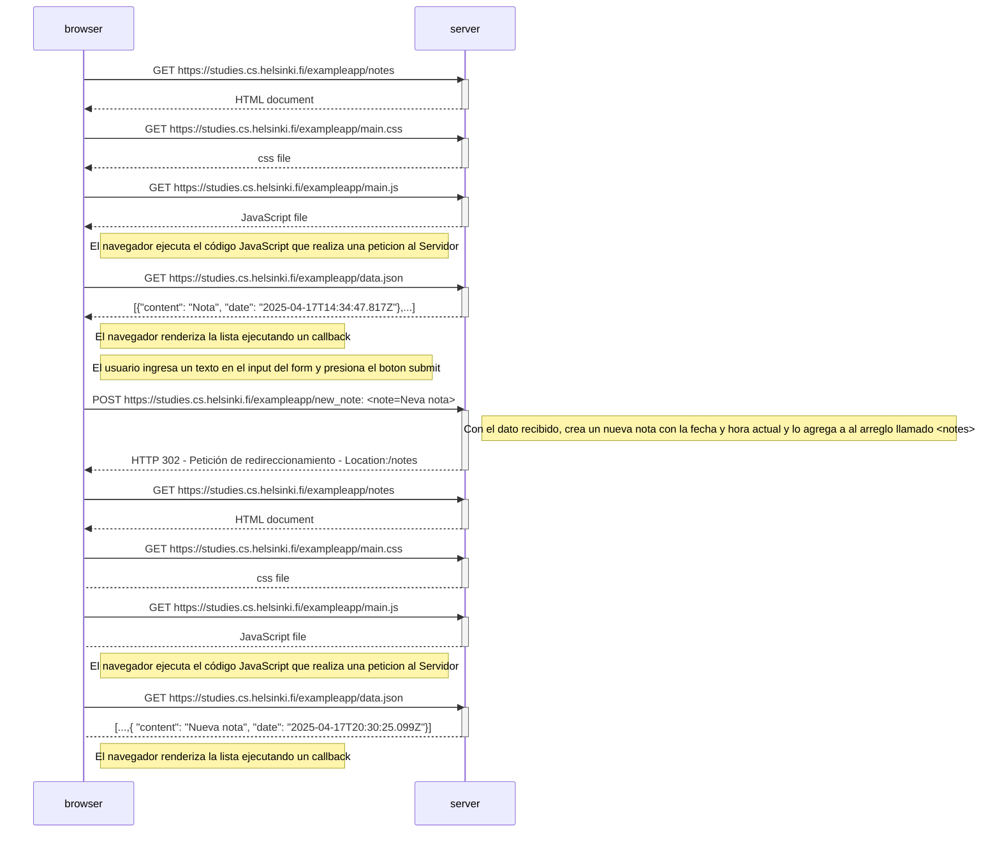

```mermaid
sequenceDiagram
    participant browser
    participant server

    browser->>server: GET https://studies.cs.helsinki.fi/exampleapp/notes
    activate server
    server-->>browser: HTML document
    deactivate server

    browser->>server: GET https://studies.cs.helsinki.fi/exampleapp/main.css
    activate server
    server-->>browser: css file
    deactivate server

    browser->>server: GET https://studies.cs.helsinki.fi/exampleapp/main.js
    activate server
    server-->>browser: JavaScript file
    deactivate server

    Note right of browser: El navegador ejecuta el código JavaScript que realiza una peticion al Servidor

    browser->>server: GET https://studies.cs.helsinki.fi/exampleapp/data.json
    activate server
    server-->>browser: [{"content": "Nota", "date": "2025-04-17T14:34:47.817Z"},...]
    deactivate server

    Note right of browser: El navegador renderiza  la lista ejecutando un callback  

    Note right of browser: El usuario ingresa un texto en el input del form y presiona el boton submit

    browser->>server: POST https://studies.cs.helsinki.fi/exampleapp/new_note: <note=Neva nota>
    activate server
    Note right of server: Con el dato recibido, crea un nueva nota con la fecha y hora actual y lo agrega a al arreglo llamado <notes>
    server-->>browser: HTTP 302 - Petición de redireccionamiento - Location:/notes
    deactivate server

    browser->>server: GET https://studies.cs.helsinki.fi/exampleapp/notes
    activate server
    server-->>browser: HTML document
    deactivate server

    browser->>server: GET https://studies.cs.helsinki.fi/exampleapp/main.css
    activate server
    server-->browser: css file
    deactivate server

    browser->>server: GET https://studies.cs.helsinki.fi/exampleapp/main.js
    activate server
    server-->browser: JavaScript file
    deactivate server

    Note right of browser: El navegador ejecuta el código JavaScript que realiza una peticion al Servidor

    browser->>server: GET https://studies.cs.helsinki.fi/exampleapp/data.json
    activate server
    server-->browser: [...,{ "content": "Nueva nota", "date": "2025-04-17T20:30:25.099Z"}]
    deactivate server

    Note right of browser: El navegador renderiza  la lista ejecutando un callback  
```