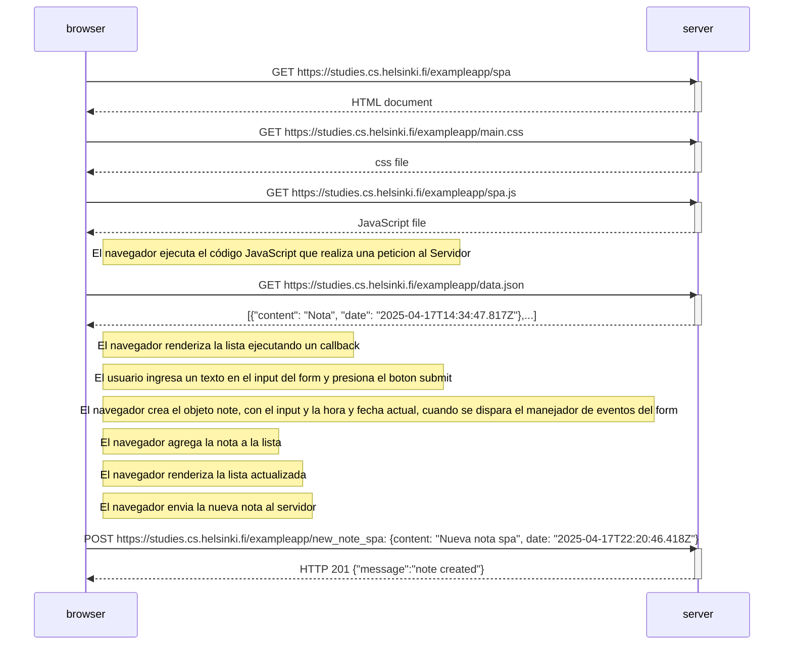

```mermaid
sequenceDiagram
    participant browser
    participant server

    browser->>server: GET https://studies.cs.helsinki.fi/exampleapp/spa
    activate server
    server-->>browser: HTML document
    deactivate server

    browser->>server: GET https://studies.cs.helsinki.fi/exampleapp/main.css
    activate server
    server-->>browser: css file
    deactivate server

    browser->>server: GET https://studies.cs.helsinki.fi/exampleapp/spa.js
    activate server
    server-->>browser: JavaScript file
    deactivate server

    Note right of browser: El navegador ejecuta el código JavaScript que realiza una peticion al Servidor

    browser->>server: GET https://studies.cs.helsinki.fi/exampleapp/data.json
    activate server
    server-->>browser: [{"content": "Nota", "date": "2025-04-17T14:34:47.817Z"},...]
    deactivate server

    Note right of browser: El navegador renderiza  la lista ejecutando un callback  

    Note right of browser: El usuario ingresa un texto en el input del form y presiona el boton submit

    Note right of browser: El navegador crea el objeto note, con el input y la hora y fecha actual, cuando se dispara el manejador de eventos del form

    Note right of browser: El navegador agrega la nota a la lista

    Note right of browser: El navegador renderiza la lista actualizada

    Note right of browser: El navegador envia la nueva nota al servidor
    
    browser->>server: POST https://studies.cs.helsinki.fi/exampleapp/new_note_spa: {content: "Nueva nota spa", date: "2025-04-17T22:20:46.418Z"}
    activate server
    server-->>browser: HTTP 201 {"message":"note created"}
    deactivate server
```